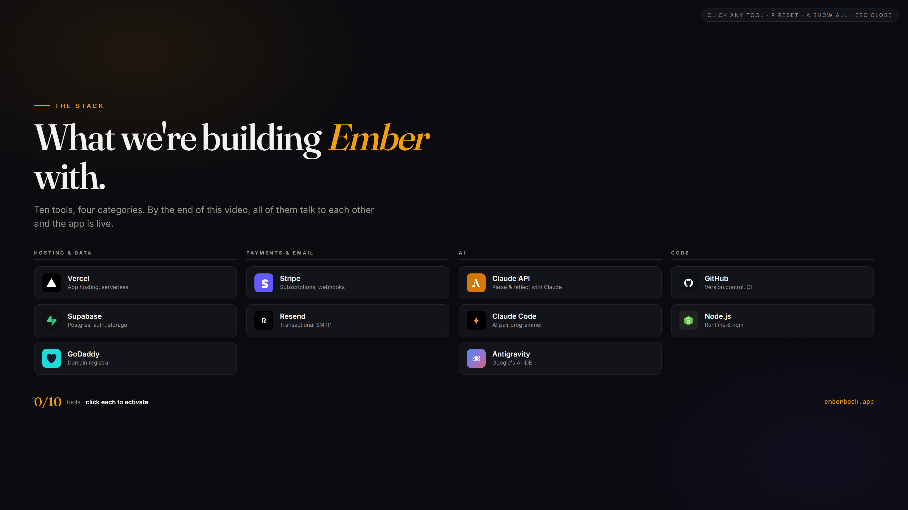
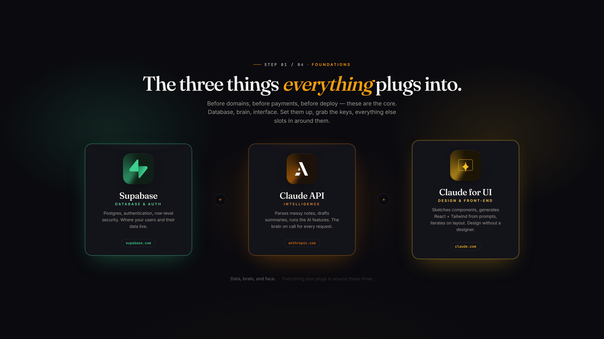

<div align="center">

# Ember

### *Small fires, long burns.*

A calm daily-logging companion that turns messy notes into clean signal — training, journal, diet, meditation. AI-parsed, privately yours, quietly accountable.

**[Live → emberbook.app](https://emberbook.app)**

<br/>


<br/>


</div>

---

## What is Ember?

Ember is a daily logging app for people who'd rather write than tap. You pour your day into three text boxes — **training**, **journal**, **diet** — and Claude parses the mess into structured logs: exercises, sets, moods, themes, meal quality. Your streaks stay lit. A weekly reflection surfaces patterns across everything you wrote.

*Small fires, long burns* is the philosophy. The goal isn't to go hard once. It's to keep a small flame alive over months — and to make the logging itself so low-friction that you keep showing up.

---

## Features

### 🔥 Messy → structured, in one tap
Write `"4x bench 185, 3x pull-ups, 2mi run, gassed"` and get back a structured workout entry with exercises, sets, reps, load, intensity, and duration — editable in a review modal before saving. The AI infers what it can; you refine what it missed.

### 🧘 Hidden-duration meditation
Set a min/max range (e.g. 5–15 minutes). The timer picks a secret duration inside it. When it chimes, guess how long you sat. Over weeks, your time-sense sharpens — and you see it on a chart of actual vs. guessed.

### ✍️ Weekly reflections (Pro)
Claude reads your week across training + journal + diet together and writes a four-section reflection: an opening hook, specific patterns observed, wins worth celebrating, and a forward-looking close. Not hype. Not generic.

### 🫥 Community without feeds
Opt-in "discoverable" mode surfaces kindred spirits by **theme overlap** — the topics that recur in your journal — never your actual entries. Private by default, row-level security enforces it at the database. No follows, no likes, no feed.

### 🔥 Streak flames with milestones
7, 14, 30, 60, 90, 100, 180, 365-day flames each get a unique celebration: a sliding banner, confetti, and haptic feedback on mobile. Motivation is the product.

### 💎 Seven-day Pro trial
- **Free:** 3 AI parses/day, silent + pink noise meditations, all tracking features
- **Pro ($6.99/mo):** unlimited parsing, weekly reflections, full ambient library (rain, ocean, brown, hum…)
- **7-day trial:** no charge up front, cancel anytime from the built-in Stripe portal

---

## The stack, visually

<div align="center">



*Ten tools, four categories. Everything talks to everything else.*

<br/>



*The three things everything plugs into: Supabase, Claude, Claude for UI.*

</div>

> More product screenshots (home, dashboard, meditation, community) will land in [`docs/screenshots/`](docs/screenshots/) — capture recipe in the [folder README](docs/screenshots/README.md).

---

## Tech stack

**Frontend**
- Next.js 15 (App Router, Turbopack)
- React 19, TypeScript 5
- Tailwind CSS 4
- Recharts, lucide-react
- Inter + Fraunces (Google Fonts)

**Backend / data**
- Supabase (Postgres, Auth, RLS policies)
- Stripe (subscriptions, webhooks, customer portal)
- Anthropic Claude API (claude-sonnet-4) — parsing + summaries
- Resend (transactional SMTP via Supabase Auth)

**Infrastructure**
- Vercel (hosting + serverless API routes)
- Sentry (error tracking + session replay)
- GitHub (source of truth, auto-deploys on push)

---

## Architecture

```
 ┌──────────────┐        ┌─────────────────────┐
 │   Browser    │ ─────► │   Next.js routes    │
 │ (React 19)   │        │ /api/process, etc.  │
 └──────┬───────┘        └──────────┬──────────┘
        │                           │
        │ Supabase client           ├─► Claude API  (parse + reflect)
        ▼                           ├─► Stripe API  (checkout + portal)
 ┌──────────────┐                   └─► Supabase    (RLS-scoped writes)
 │   Supabase   │ ◄─────────────────────────┘
 │  Postgres +  │
 │  Auth + RLS  │ ◄────── Stripe webhook ─── /api/stripe/webhook
 └──────────────┘         (updates profiles.subscription_tier)
```

**Row-level security:** every user-data table (`day_logs`, `meditations`, `profiles`, `friendships`, `public_profiles`, `ai_usage`) has RLS policies scoped to `auth.uid()`. The service-role key is only used server-side in routes that need to bypass RLS (Stripe webhook, usage accounting).

---

## Getting started

```bash
git clone https://github.com/jmarchese1/ember
cd ember
npm install
cp .env.example .env.local
# fill in .env.local with your own keys (see below)
npm run dev
```

Open [http://localhost:3000](http://localhost:3000).

### Required accounts

| Service | What for | Free tier OK? |
|---|---|---|
| [Supabase](https://supabase.com) | DB, auth, storage | ✓ |
| [Anthropic](https://console.anthropic.com) | Claude API | pay-per-use |
| [Stripe](https://stripe.com) | Subscriptions | ✓ (no base fee) |
| [Resend](https://resend.com) | SMTP for auth emails | ✓ (3k emails/mo) |
| [Vercel](https://vercel.com) | Hosting | ✓ hobby |
| [Sentry](https://sentry.io) *(optional)* | Error tracking | ✓ (5k events/mo) |

See [.env.example](.env.example) for the full list of environment variables.

### Local dev commands

```bash
npm run dev       # start dev server on :3000
npm run build     # production build
npm run lint      # eslint
```

---

## Project structure

```
ember/
├── app/                  # Next.js App Router
│   ├── api/              # Server routes (process, summary, usage, stripe/*)
│   ├── legal/            # Terms + Privacy pages
│   └── page.tsx          # Main app shell
├── components/           # UI (tabs, modals, charts, flame)
├── lib/                  # storage, utils, supabase clients, meditation-sounds
├── supabase/             # email templates
├── docs/                 # screenshots + design notes
├── sentry.*.config.ts    # Sentry setup
└── .env.example          # all env vars, no secrets
```

---

## Deployment

Deployed on **Vercel**, auto-deployed from `main`. Stripe webhook points at `https://emberbook.app/api/stripe/webhook`. Supabase Auth SMTP goes through Resend (`noreply@emberbook.app`).

To deploy your own fork:

1. Push to a GitHub repo
2. Import into Vercel → add all `.env.example` vars in **Production** scope
3. In Stripe Dashboard → Webhooks → add endpoint `https://your-domain/api/stripe/webhook`, copy signing secret into `STRIPE_WEBHOOK_SECRET`
4. In Supabase → Auth → SMTP → point at Resend
5. Verify your sender domain in Resend

---

## License

Personal project. All rights reserved. Not open-source licensed — feel free to read, learn, adapt patterns, but don't redistribute as-is.

## Author

Built by **Jason Marchese** · [emberbook.app](https://emberbook.app)

Part of a series on building end-to-end products with **Claude Code** + the modern SaaS stack. Tutorial on YouTube (coming soon).

---

<div align="center">
<sub>Small fires, long burns.</sub>
</div>
